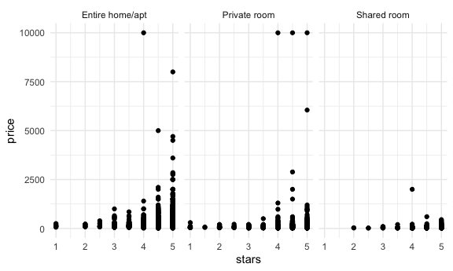
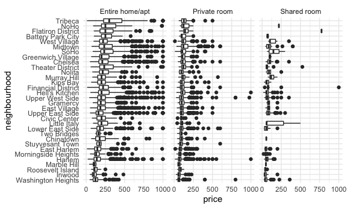
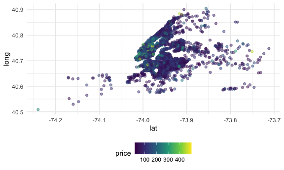

Case study
================

## load a dataset

``` r
data("nyc_airbnb")
```

-   how many rentals are there? of what type? In what places?
-   is price correlated with review score
-   which neighborhood most popular? expensive? highest review?

``` r
nyc_airbnb = 
  nyc_airbnb %>% 
  mutate(stars = review_scores_location / 2) %>% 
  rename(borough = neighbourhood_group)
```

let’s try count things:

``` r
nyc_airbnb %>% 
  #janitor::tabyl(borough, room_type) #create table
  count(borough, room_type) %>% 
  pivot_wider(
    names_from = room_type,
    values_from = n
  )
```

    ## # A tibble: 5 × 4
    ##   borough       `Entire home/apt` `Private room` `Shared room`
    ##   <chr>                     <int>          <int>         <int>
    ## 1 Bronx                       192            429            28
    ## 2 Brooklyn                   7427           9000           383
    ## 3 Manhattan                 10814           7812           586
    ## 4 Queens                     1388           2241           192
    ## 5 Staten Island               116            144             1

let’s look at price and room type

``` r
nyc_airbnb %>% 
  ggplot(aes(x = stars, y = price)) +
  geom_point() +
  facet_grid(. ~ room_type)
```

    ## Warning: Removed 10037 rows containing missing values (geom_point).



price and neighborhood

``` r
nyc_airbnb %>% 
  filter(borough == "Manhattan") %>% 
  group_by(neighbourhood) %>% 
  summarize(mean_price = mean(price, na.rm = TRUE))
```

    ## # A tibble: 32 × 2
    ##    neighbourhood      mean_price
    ##    <chr>                   <dbl>
    ##  1 Battery Park City        221.
    ##  2 Chelsea                  233.
    ##  3 Chinatown                158.
    ##  4 Civic Center             173.
    ##  5 East Harlem              128.
    ##  6 East Village             178.
    ##  7 Financial District       197.
    ##  8 Flatiron District        319.
    ##  9 Gramercy                 189.
    ## 10 Greenwich Village        258.
    ## # … with 22 more rows

``` r
nyc_airbnb %>% 
  filter(borough == "Manhattan", 
         price <= 1000) %>% 
  mutate(neighbourhood = fct_reorder(neighbourhood, price)) %>%  # ascending order
  ggplot(aes(x = neighbourhood, y = price))+
  geom_boxplot() + 
  coord_flip() +
  facet_grid(.~room_type)
```



price vs location

``` r
nyc_airbnb %>% 
  filter(price < 500) %>% 
  sample_n(5000) %>% #sample 5000 obs
  ggplot(aes(x = lat, y = long, color = price)) +
  geom_point(alpha = .5)
```



retry leaflet

``` r
nyc_airbnb %>% 
  filter(price < 500) %>% 
  leaflet() %>% 
  addTiles() %>% 
  addMarkers(~lat, ~long)
```
